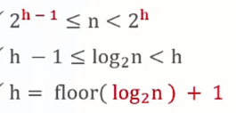
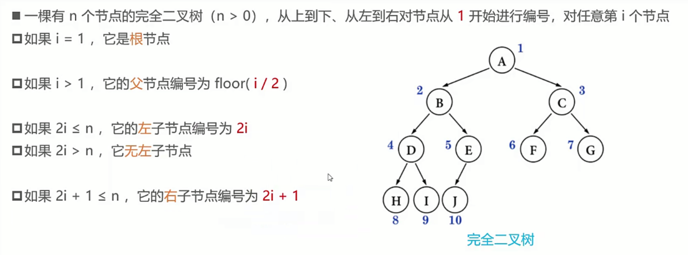
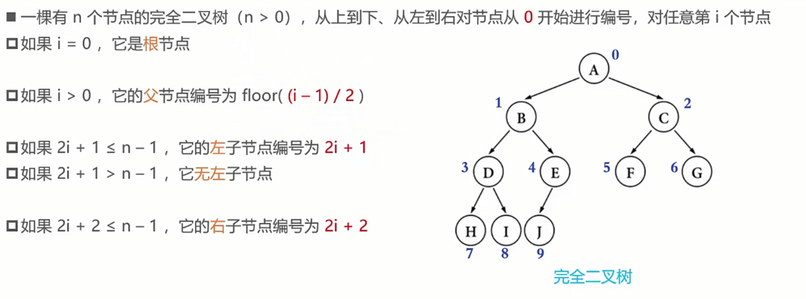

### 基本概念

- 节点的度（degree）：子树的个数
- 树的度：所有节点中的最大值
- 叶子节点（leaf）：度为0的节点
- 非叶子节点：度不为0的节点
- 层数：根节点在第一层（第0层）
- 节点的深度（depth）：从根节点到当前节点的唯一路径上的节点总数
- 节点的高度（height）：从当前节点到最远叶子节点的路径上的节点总数
- 树的深度：所有节点深度的最大值
- 树的高度：所有节点高度中的最大值，等于树的深度

### 二叉树（Binary Tree）

- 每个节点的度最大为2
- 左子树和右子树是有顺序的
- 即使某节点只有一颗子树，也要区分左右子树
- 非空二叉树的第i层，最多有2^(i-1)个节点（i >= 1)
- 在高度为h的二叉树上最多有(2^h-1)个节点（h >= 1）
- 对于任意一颗非空二叉树，如果叶子节点个数为n0，度为2的节点个数为n2，则有：n0 = n2 + 1
  > 假设度为1的节点个数为n1，那么二叉树的节点总数 n = n0 + n1 + n2
  > 二叉树的边数 T = n1 + 2 * n2 = n - 1 = n0 + n1 + n2 - 1
- 真二叉树：所有节点的度都要么为0，要么为2
- 满二叉树：所有节点的度都要么为0，要么为2，且所有的叶子节点都在最后一层

#### 完全二叉树

- 度为1的节点只有左子树
- 度为1的节点要么只有1个，要么有0个
- 同样节点数量的二叉树，完全二叉树的高度最小
- 假设完全二叉树的高度为h（h >= 1），那么
  > - 至少有2^(h-1)个节点 （2^0 + 2^1 + …… + 2^(h-2) + 1）
  > - 至多有(2^h-1)个节点 （2^0 + 2^1 + …… + 2^(h-1), 满二叉树）
  > - 总节点数量为n
  > - 

- 
- 

前驱结点：中序遍历时的前一个结点